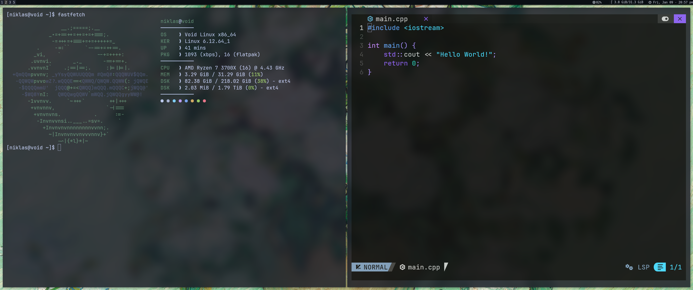
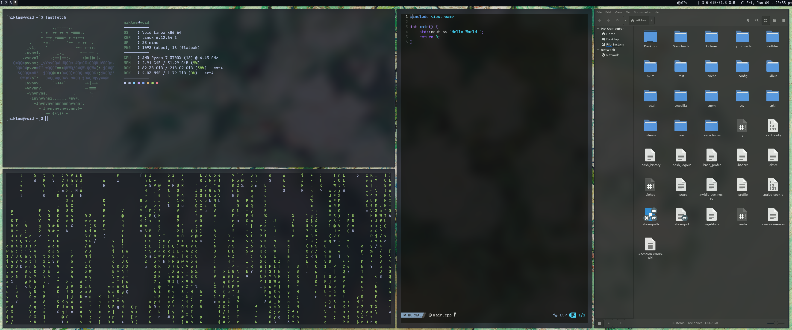
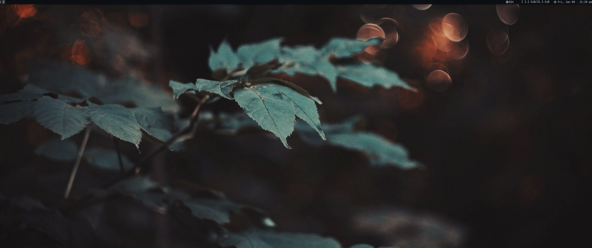

# Dotfiles (Void Linux)

Minimalist i3 setup on Void Linux.

## Screenshots





## Stack
- WM: i3
- Terminal: kitty
- Compositor: picom
- Launcher: rofi
- Bar: i3status
- Wallpaper: feh + autorandr

## Features
- Dual monitor (DP-0 (2560x1440) + HDMI-1 (3440x1440))
- Transparent UI
- Ergonomic keybindings
- Works with NVIDIA GPU's
- Large collection of wallpapers

## Keybinds

**Launch**
- $mod + Return → Terminal (kitty)
- $mod + Shift + f → File manager (nemo)
- $mod + Shift + b → Browser (firefox)
- $mod + d → App launcher (rofi drun)
- $mod + p → Power menu script

**Workspaces**
- $mod + 1–10 → Switch to workspace 1–10
- $mod + Shift + 1–10 → Move focused window to workspace 1–10

**Window Management**
- $mod + v → Split horizontally
- $mod + h → Split vertically
- $mod + Shift + q → Close focused window

**i3 Control**
- $mod + Shift + r → Restart i3
- $mod + Shift + e → Exit i3 (with confirmation)


## Wallpaper Disclaimer
All wallpapers included in this repository are the property of their respective owners.
No copyright infringement is intended.

These assets are included solely to demonstrate configuration appearance and workflow.
They are provided “as-is” and are **not licensed for redistribution or commercial use**.

If you plan to reuse any wallpapers, please ensure you have the appropriate rights
or replace them with your own images.

Upon request by a rights holder, any content will be removed immediately.

## Installation
```sh
git clone https://github.com/niklaslautenschlager/dotfiles.git
cd dotfiles
./install.

